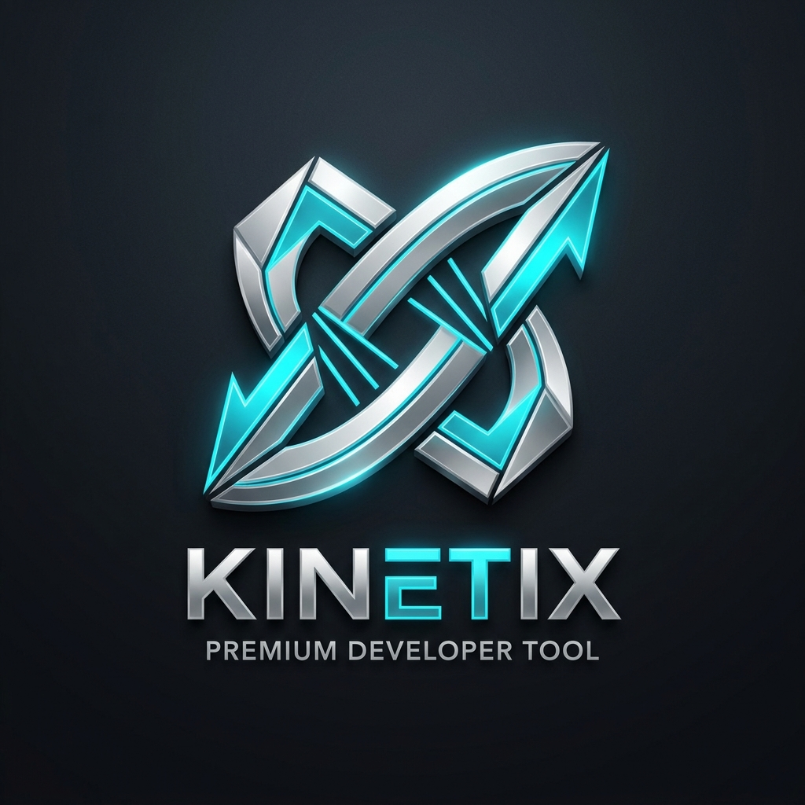

# Kinetix IDE: The Precision-Engineered Environment for AI Orchestration

<p align="center">
  
</p>

> **Kinetix IDE: Power, Orchestrated.**

You shouldn't have to manage your computer to build your vision. **Kinetix IDE** is a precision-engineered workspace that brings order to the complexity of AI development. It is a high-performance orchestration layer that monitors your system’s vitals in real-time and automates the heavy lifting in the background.

Designed for developers who demand both raw performance and effortless clarity, Kinetix IDE turns a chaotic workstation into a tuned, professional-grade lab.

Stop managing the machine. Start building the future.

---

## 🏗️ Architecture Blueprint

This repository represents a "Compute-First" developer workstation orchestration template. It decouples telemetry monitoring, process execution, and system-level thread schedules into five clean components:

```
kinetix-ide/
├── README.md                  # Main manual & sales pitch copy
├── LICENSE                    # MIT License for distribution
├── console_page.png           # Hero screenshot of the Kinetix Console UI
├── core/                      # Core infrastructure
│   ├── ecosystem.config.js    # PM2 process orchestrator definitions
│   ├── setup.ps1              # Dependency check & .venv installer (Windows)
│   └── setup.sh               # Dependency check & .venv installer (macOS/Linux)
├── interface/                 # Visual dashboard console
│   ├── server.js              # Express API server backend
│   ├── package.json           # Node.js dependencies
│   └── public/                # Glassmorphic client dashboard
│       ├── index.html         # HTML layout client
│       ├── theme.css          # Premium dark-mode stylesheet
│       └── app.js             # Polling bindings & reactive controls
├── config/                    # Configuration configurations
│   └── .env.example           # Sanitized variables template
└── docs/                      # Technical manuals
    └── System_Manual.md       # 24-thread/16-core scheduling whitepaper
```

---

## ⚡ Core Operational Components

### 1. The Core Infrastructure (`/core`)
*   **PM2 Orchestrator (`ecosystem.config.js`):** Unified launcher that handles dependencies, maximum memory constraints, and auto-restart states for the web console and background python telemetry.
*   **One-Click Installers (`setup.sh`/`setup.ps1`):** Scripts creating a local virtual environment (`.venv`), installing dependencies, setting environment variables, and configuring the Tailscale-aware port bindings.

### 2. The Visual Dashboard (`/interface`)
*   **Core Grid Monitor:** High-fidelity, HSL customized dark-mode panel displaying core CPU, RAM, discrete GPU load, and local LLM caches.
*   **Interactive Controllers:** Direct API hooks enabling you to stop, start, and restart background tasks from a secure, clean visual dashboard.

### 3. Zero-Overhead GPU Telemetry (`telemetry.py`)
*   **NVML Driver C-Bindings:** Queries the GPU driver directly in-process through native `pynvml` bindings, delivering sub-millisecond telemetry with 0% CPU process-forking overhead. Falls back to a clean `nvidia-smi` subprocess check if bindings are unavailable.

### 4. The Documentation Manuals (`/docs`)
*   **Thread Allocation Guide (`System_Manual.md`):** Deep technical guide explaining how to align Node/libuv processes with high-concurrency configurations, optimize V8 garbage collection limits, and allocate local GPU VRAM.

---

## 🚀 Getting Started

1. **Clone this repository** into your local directory.
2. **Execute installer** to create the virtual environment and verify dependencies:
   ```powershell
   Set-ExecutionPolicy Bypass -Scope Process -Force
   .\core\setup.ps1
   ```
3. **Optimize cores and thread pool sizes:**
   ```powershell
   .\scripts\init_node.ps1
   ```
4. **Boot the background stack:**
   ```powershell
   pm2 start core/ecosystem.config.js
   ```
5. **Open the browser** to `http://localhost:3000` to access the Kinetix Core Grid Monitor.

---
*Created by Enefiok Usoro. Kinetix IDE is licensed under the MIT License.*
