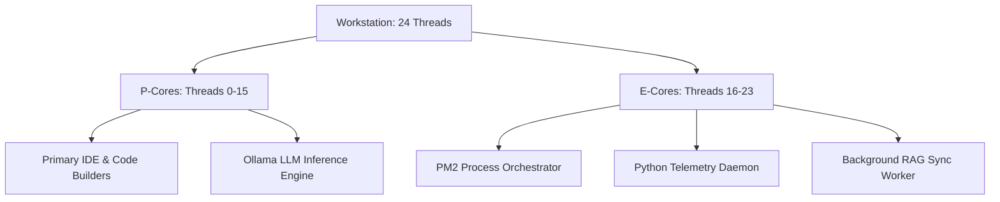

# Kinetix Workstation Orchestration: High-Performance System Manual

This technical whitepaper details the architectural design and system optimizations applied in the **Kinetix IDE Blueprint**. Developers purchasing this template receive a pre-configured, production-ready environment tuned specifically for parallelized AI workflows, local LLM execution, and low-latency system telemetry.

---

## 📊 The A+ Performance Evaluation Grade

At the center of the Kinetix Core Grid Monitor is the **Evaluation Rank** (e.g., **A+**). Rather than displaying a raw, hard-to-read list of system parameters, Kinetix uses a unified load-averaging algorithm to calculate workstation efficiency.

The grade is computed using the following equation:

$$\text{Average Load} = \frac{\text{CPU}_\% + \text{RAM}_\% + \max(\text{GPU-Core}_\%, \text{GPU-VRAM}_\%)}{3}$$

### Grade Status Thresholds

| Grade | Avg Load Range | Performance Description | Recommended Action |
| :---: | :---: | :--- | :--- |
| **A+** | `< 15%` | **Optimal Performance:** Abundant thermal and computing headroom. | Ideal for parallel compilations or scaling local agent workflows. |
| **A** | `15% - 29.9%` | **High Performance:** Smooth operations, light background tasks. | Safe to execute standard local inference. |
| **B** | `30% - 49.9%` | **Nominal Load:** Moderate compute utilization. | Monitor thread allocation if launching new sub-processes. |
| **C** | `50% - 69.9%` | **Heavy Traffic:** Workstation is actively computing. | Delay long-running parallel scripts. |
| **D** | `70% - 84.9%` | **Near Saturation:** System throttle threshold. | Clear unused processes or disable RAG agent sync. |
| **F** | `≥ 85%` | **System Overload:** High risk of memory paging or freeze. | Terminate PM2 tasks immediately. |

---

## 🧵 Thread Scheduling & Core Affinity (16 Cores / 24 Threads)

Modern hybrid x86 architectures (e.g., Intel Alder Lake/Raptor Lake/Arrow Lake) segment computing power into two distinct core profiles:
*   **Performance Cores (P-Cores):** High-frequency cores with hyper-threading (supporting 2 logical threads per core). Used for low-latency tasks like code compiling or LLM model loaders.
*   **Efficient Cores (E-Cores):** Single-threaded cores optimized for background operations. Used for file watchers, telemetry loop daemons, and database sync.

For a standard **16-Core / 24-Thread workstation** (8 P-Cores with 16 threads, and 8 E-Cores with 8 threads), Kinetix IDE structures tasks to prevent thread starvation.

### Core Affinity Allocation Map



To ensure telemetry gathering and file syncing do not interrupt primary development tasks, the setup scripts bind these utilities to E-cores, reserving the maximum compute capacity of P-cores for compiling and AI inference.

---

## ⚡ Node.js Engine Optimization

Out of the box, Node.js is optimized for simple, single-threaded I/O operations. When repurposed for running a developer console that interfaces with heavy background compilers and local model inference, default configurations will bottleneck. Kinetix applies two critical runtime optimizations:

### 1. Libuv Threadpool Size Override (`UV_THREADPOOL_SIZE`)

Node.js delegates all asynchronous, non-blocking disk I/O, DNS lookup, and CPU-intensive operations (like cryptography or compression) to its underlying C-library threadpool, **Libuv**.

*   **The Problem:** The default Libuv threadpool size is only **4**. If a developer triggers a build, runs a local vector database query, and makes simultaneous telemetry dashboard requests, Node's event loop blocks, resulting in severe latency spikes.
*   **The Optimization:** Kinetix automatically scales the threadpool size to match the workstation's total logical thread count (e.g., **24** threads) using:
    ```powershell
    $env:UV_THREADPOOL_SIZE = [System.Environment]::ProcessorCount
    ```
    This removes I/O queuing bottlenecking and ensures instant dashboard responsiveness even under stress.

### 2. V8 Garbage Collection & Heap Optimization (`NODE_OPTIONS`)

The Chrome V8 engine defaults its memory heap limit to ~1.4GB on 64-bit systems to prevent memory leaks from running away on the web.

*   **The Problem:** Running massive RAG synchronization routines, serving large workspace files, or executing extensive compilation tasks within Node will easily exceed this limit, causing an immediate `FATAL ERROR: Ineffective mark-compacts near heap limit Allocation failed - JavaScript heap out of memory` crash.
*   **The Optimization:** Kinetix overrides this heap allocation size to utilize up to **8GB (8192MB)**:
    ```powershell
    $env:NODE_OPTIONS = "--max-old-space-size=8192"
    ```
    This grants the console's V8 runner adequate headroom for processing massive document databases and complex file arrays.

---

## 🧠 GPU Acceleration & Local VRAM Configuration

Local AI execution relies heavily on GPU memory (VRAM). Unlike CPU RAM, when GPU VRAM saturates, models cannot easily "page" memory without suffering a **90%+ performance drop**.

### Ollama Model Footprints and VRAM Budgets

For a standard developer workstation equipped with a 16GB discrete GPU (e.g., NVIDIA RTX 4080 / Mobile RTX 4090):

| Model Name | Parameter Size | Quantization | Approximate VRAM Footprint | Headroom Status |
| :--- | :---: | :---: | :---: | :---: |
| **Llama-3.2 (3B)** | 3 Billion | Q4_K_M | ~2.0 GB | **Optimal** (Huge VRAM Headroom) |
| **Phi-4 (14B)** | 14 Billion | Q4_K_M | ~9.1 GB | **Comfortable** (~7 GB Free VRAM) |
| **Qwen-2.5 (32B)** | 32 Billion | Q4_K_M | ~18.5 GB | **Over-budget** (VRAM Spillover) |

> [!WARNING]
> **VRAM Spillover warning:** Running models that exceed your physical VRAM (like a 32B model on a 16GB card) forces the system to offload layers to CPU system RAM. This causes token generation speed to plunge from ~50 tokens/sec to `< 2 tokens/sec`. Always match model sizes to your VRAM budget shown on the Kinetix Console!
